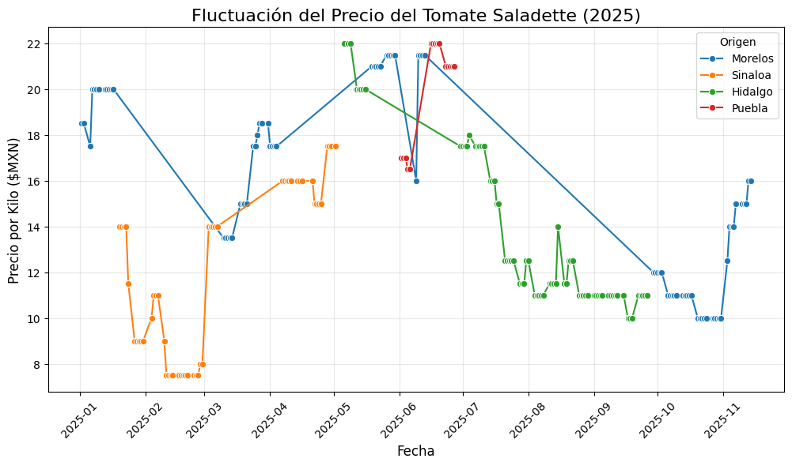
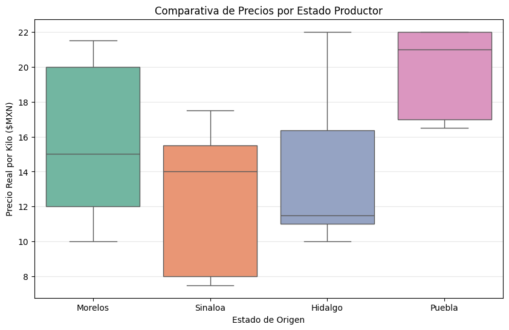
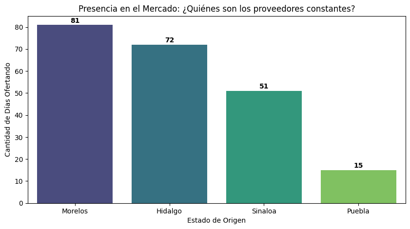
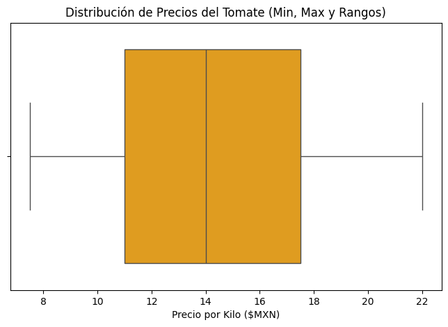

# Análisis de Estacionalidad y Fluctuación de Precios en el Mercado del Tomate (2025)

## Descripción del Proyecto
Este repositorio contiene un análisis exploratorio de datos (EDA) enfocado en la dinámica del mercado del Tomate Saladette en México. El objetivo es identificar patrones de comportamiento en los precios mayoristas, analizar la estabilidad por región y evaluar la presencia de mercado de los diferentes estados productores (Sinaloa, Morelos, Hidalgo, Puebla).

## Objetivos
1. **Análisis Temporal:** Visualizar la volatilidad y tendencia de precios diarios a lo largo del ciclo anual 2025.
2. **Comparativa Regional:** Evaluar la competencia de precios entre estados productores.
3. **Distribución de Precios:** Identificar los rangos mínimos, máximos y promedios generales del mercado.
4. **Presencia de Mercado:** Determinar qué estados mantienen una oferta constante durante el año.

## Estructura del Repositorio
* `data/`: Datos históricos de precios y volumen (.csv).
* `notebooks/`: Código fuente en Python para el procesamiento y graficado.
* `images/`: Gráficas generadas del comportamiento del mercado.

## Visualización de Resultados

### 1. Fluctuación Temporal de Precios por Origen

*(Análisis de la volatilidad diaria de precios en MXN/kg, diferenciando por región de origen durante el ciclo 2025)*

### 2. Comparativa de Precios por Estado (Boxplot)

*(Evaluación de la dispersión de precios: se observa que Puebla tiende a precios más altos, mientras que Sinaloa muestra mayor variabilidad)*

### 3. Presencia en el Mercado (Días Ofertando)

*(Gráfica de barras que muestra la constancia de los proveedores. Morelos e Hidalgo lideran la oferta constante en el mercado)*

### 4. Distribución General de Precios (Rango Global)

*(Análisis global del precio del tomate: el 50% de los datos se concentra entre los 11 y 18 pesos, con rangos extremos bien definidos)*

## Tecnologías Utilizadas
* **Python** (Procesamiento de datos)
* **Pandas** (Manipulación de datos y series temporales)
* **Matplotlib & Seaborn** (Visualización de datos financieros y estadísticos)

## Instalación y Uso
1. Clonar el repositorio.
2. Instalar dependencias: `pip install -r requirements.txt`
3. Ejecutar el notebook para reproducir el análisis.

## Autor
Miguel Angel Lopez Veloz

Estudiante de Ingeniería en Desarrollo de software | Entusiasta del Análisis de Datos
